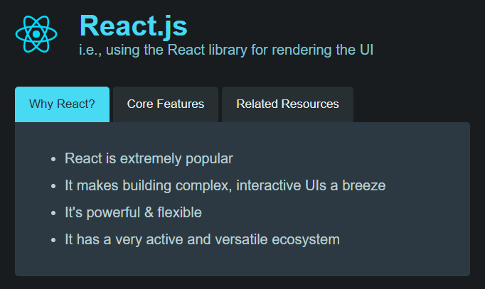
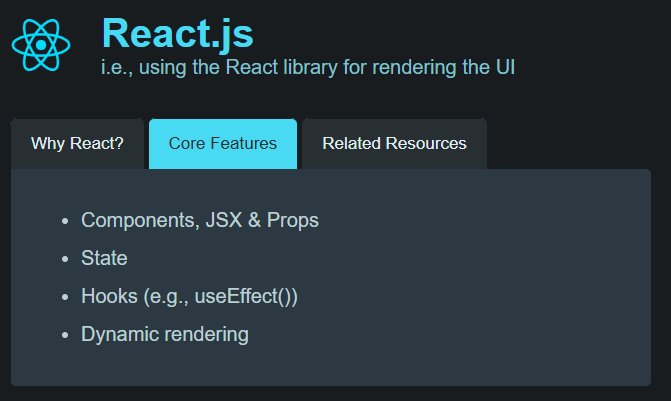
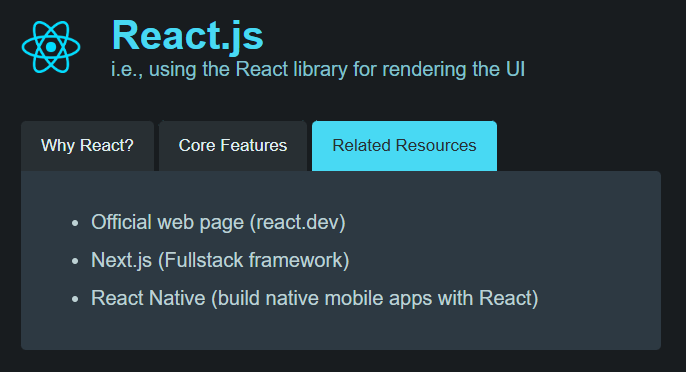
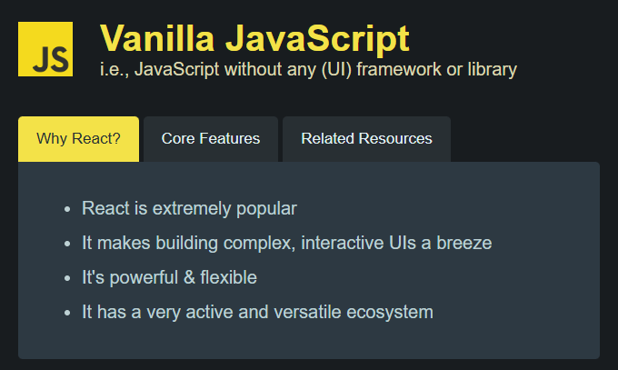
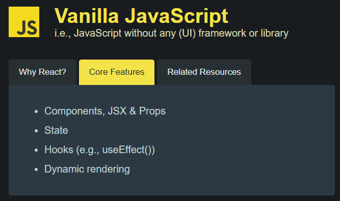
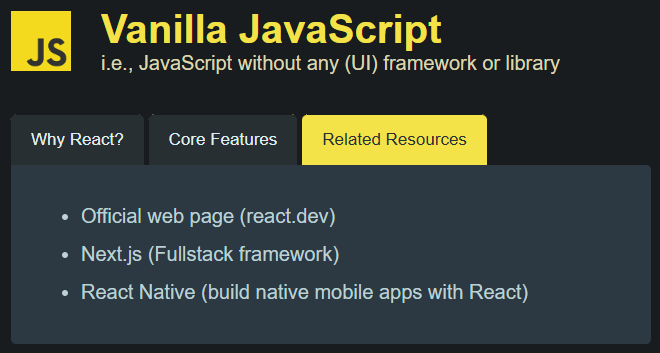

#  ReactJS vs "Vanilla JavaScript"
# Vanilla JavaScript vs React: Understanding the Basics

## **Overview**

This project is a simple website designed to explain the key differences between **Vanilla JavaScript** and **ReactJS**, focusing on their use in web development.

### What is **Vanilla JavaScript**?
- Vanilla JavaScript refers to using plain JavaScript without any libraries or frameworks.
- It gives full control over the DOM but requires more effort for complex UIs.
- Suitable for smaller projects or scenarios where performance and simplicity are critical.

### What is **React**?
- React is a JavaScript library used for building user interfaces.
- It simplifies the creation of dynamic, interactive, and complex web applications.
- React is widely adopted because of its flexibility, component-based architecture, and active community.


---

This website provides an introductory comparison, highlighting the advantages of using React for modern web development.

## Using **ReactJS**:

<div style="display: flex; justify-content: space-evenly;">
  
  
  
</div>


## Using **Vanilla JavaScript**:

<div style="display: flex; justify-content: space-evenly;">
  
  
  
</div>

### **Technologies Used**

- **Frontend**:
  - HTML for structure.
  - CSS for styling (dark theme).
  - JavaScript (Vanilla) for basic interactivity.

---


---

## **How to Run the Project**

1. Clone the repository:
   ```bash
   git clone https://github.com/your-username/vanilla-vs-react-website.git
